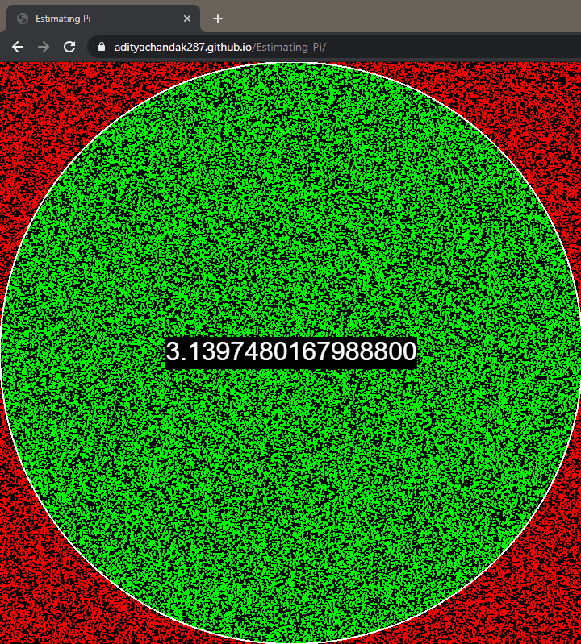

# Estimating Pi

## About

Estimating the value of Pi using the Monte Carlo Method.

[p5.js](https://p5js.org/) used for rendering the animations on the canvas.

## Demo

[Check it out here](https://adityachandak287.github.io/Estimating-Pi/)

## Concept

## Credits

[Daniel Shiffman's Youtube Video](https://youtu.be/5cNnf_7e92Q)
